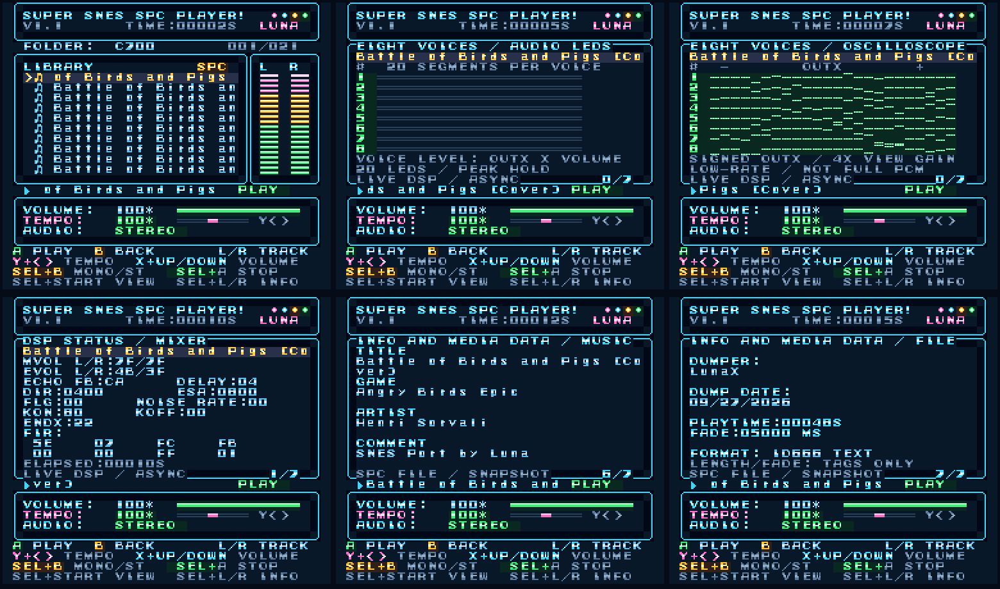

# Super SNES SPC Player! 1.1

Edición pública 1.1 de Luna, basada en la versión de desarrollo v1.3.1-E.

Copia **roms/SSPC11H.SMC** (HiROM FastROM) o **roms/SSPC11L.SMC** (alternativa LoROM) a tu microSD FAT32 y abre la ROM desde el menú del cartucho. Ambas ocupan 4 MiB. Conserva tus carpetas: los SPC originales compatibles se cargan directamente, sin conversión ni índice adicional. El reproductor no escribe en la tarjeta.

Requiere un cartucho con una interfaz SD compatible con Super EverDrive V1.
No todos los flashcarts implementan esa interfaz.

## Características

- Corregida la lectura de los comandos de tempo y volumen después de cambiar a MONO, también dejando Select pulsado o presionando primero la dirección y después X/Y. Se conservan las pulsaciones breves durante las operaciones de audio.
- Los drivers compatibles de Donkey Kong Country conservan el ajuste de tempo al actualizar sus temporizadores.
- Arriba/abajo mueve una vez, espera 40 fotogramas (unos 0.67 segundos NTSC o 0.8 segundos PAL) y repite cada 6 fotogramas. Se conserva el salto entre el primer y último archivo.
- Tres vistas de audio: barras estéreo, 20 segmentos por cada uno de los ocho canales y trazas de OUTX del DSP.
- Páginas de mezclador/eco/FIR, volumen y afinación de canales, ADSR/GAIN, indicadores de actividad, direcciones de muestras y etiquetas ID666.
- Contador del tiempo transcurrido. Se mantienen la presentación, sonidos, pantalla de carga, títulos sin .spc y el HUD en inglés.

## Controles

| Botón | Acción |
|---|---|
| Arriba / Abajo | Navegar; mantener para repetir; vuelta entre extremos |
| A | Abrir carpeta o reproducir/reemplazar canción |
| B | Volver a la carpeta anterior sin detener la música |
| L / R | Canción anterior / siguiente |
| Y + Izquierda / Derecha | Tempo conservando afinación en drivers compatibles |
| X + Arriba / Abajo | Volumen, 0–100% |
| Select + A | Detener canción |
| Select + B | MONO / STEREO cuando esté disponible |
| Select + Start | Estéreo → ocho canales → trazas DSP; volver a vista del reproductor |
| Select + L / R | Página anterior / siguiente de información |

No necesitas RESET para navegar o detener. STEREO* indica que ese driver o distribución de memoria conserva estéreo porque no admite el control MONO.

## Qué muestran las nuevas vistas

Las trazas proceden de muestras reales del registro OUTX, amplificadas para que se vean. Se leen mucho más espaciadas que el audio PCM; no equivalen a un osciloscopio completo de PC. Las barras mantienen brevemente los niveles observados y estiman la señal de cada canal antes del volumen maestro. ON significa que se observó ENVX distinto de cero; no representa todas las fases internas de la envolvente.

START/LOOP provienen del directorio de muestras del SPC original. READ PTR muestra -- porque la posición interna de lectura BRR no está disponible para la CPU de la consola.

Las páginas de etiquetas usan ID666. La detección de texto/binario es aproximada porque el formato no tiene una bandera inequívoca. Las fechas binarias se muestran en HEX; las de texto se conservan. Los valores superiores a 65535 muestran 65535+. La duración y el fade de las etiquetas son informativos: no activan un apagado automático. No se reconstruyen etiquetas ausentes ni extensiones xid6.

## Compatibilidad y pruebas

La compatibilidad sigue siendo parcial. El error 67 puede indicar un driver, estado o distribución de memoria todavía no controlable; no significa por sí solo que el SPC esté dañado. B permite regresar. Se conserva el catálogo de compatibilidad comprobado durante el desarrollo; consulta [Juegos que ya soporta](docs/SUPPORTED_GAMES.md) para los resultados por archivo.

Las nuevas exportaciones completas de C700 que usan el driver comprobado se cargan directamente. Las exportaciones que necesitan un archivo .700 adicional siguen sin estar admitidas. Los originales no se modifican; la ROM comprueba el espacio de controles, código, muestras y eco antes de preparar una copia temporal en RAM.

Usa archivos SPC sin comprimir. Hay un máximo de 96 entradas por carpeta y 15 niveles de carpetas. Divide las colecciones grandes. No se incluyen canciones de juegos comerciales.

Las pruebas funcionales de la base de desarrollo se hicieron en Snes9x/libretro con un sistema de archivos virtual: controles, audio, silencio/restauración de volumen, temporizadores de tempo, MONO compatible, vistas/páginas, etiquetas, rechazo seguro y parada/recarga sin RESET. **Falta probar esta versión en la SNES y el cartucho reales.** El detalle está en [VALIDATION.md](docs/VALIDATION.md).

El código fuente se encuentra en src. Para compilar el catálogo incluido necesitas Python 3 y WLA-DX 10.7:

    python src/build.py --both --tool-dir "RUTA_A_WLA_DX"
    python tools/verify_release.py

Se incluyen los gráficos, sonidos BRR y comprobaciones de drivers ya compilados. Añadir soporte a otro driver requiere análisis y pruebas independientes. Los créditos están en [CREDITS.md](CREDITS.md).

## Documentación

- [Lista completa de errores](docs/ERRORES.md)
- [Compilar desde el código](docs/BUILD.md)
- [Preparar la publicación en GitHub](docs/PUBLICAR_GITHUB.md)
- [Notas del lanzamiento](RELEASE_NOTES.md)

## Licencia

No se ha elegido una licencia general para el proyecto. Los créditos de
los recursos suministrados se conservan en [CREDITS.md](CREDITS.md).

## Cambios de 1.1

- Recuperación acotada de transferencias IPL interrumpidas y confirmación del driver de sonido del menú.
- Start + X abre los créditos; B vuelve conservando la canción.
- Logo e interfaz: Ver.1.1. Créditos: Dev Ver.1.3.1-E.
- Sonido de error CHORD reducido a 5,094 bytes BRR mono.
- [Juegos que ya soporta y compatibilidad parcial](docs/SUPPORTED_GAMES.md).
